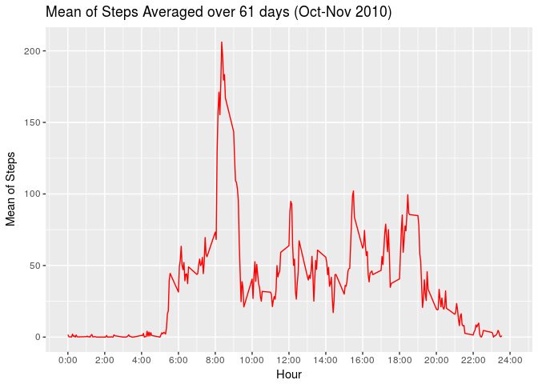
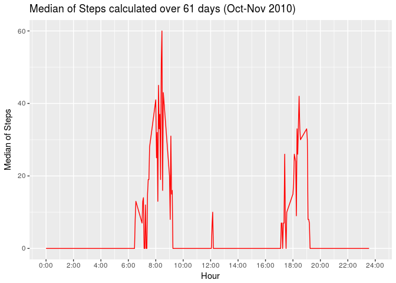
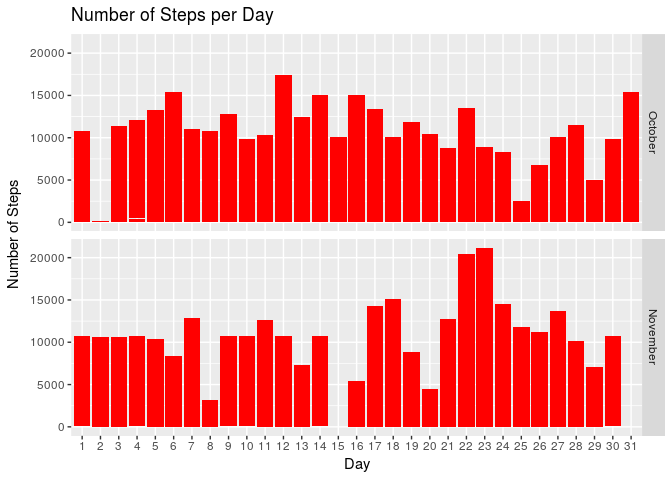
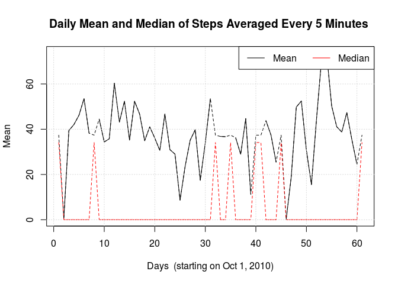
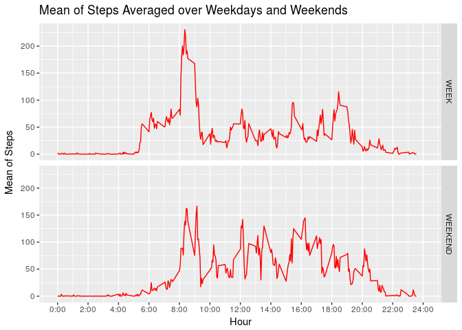

## Loading and preprocessing the data

First, we import the libraries that will be used and set the working directory. We will use the following libraries:

* Lubridate
* Dplyr
* Reshape2
* Xtable
* Ggplot2


```
## 
## Attaching package: 'lubridate'
```

```
## The following object is masked from 'package:base':
## 
##     date
```

```
## 
## Attaching package: 'dplyr'
```

```
## The following objects are masked from 'package:lubridate':
## 
##     intersect, setdiff, union
```

```
## The following objects are masked from 'package:stats':
## 
##     filter, lag
```

```
## The following objects are masked from 'package:base':
## 
##     intersect, setdiff, setequal, union
```
Then we import the data

```r
activity <- read.csv("activity.csv")
```

## What is the mean and median of the total number of steps taken per day?

In order to know the mean and median per day we divide the steps per day. But first we create new variables (month and day) by using the lubridate package which makes it easier to work with dates:


```r
activity <- mutate(activity, date = ymd(activity$date))
activity <- mutate(activity, month = month(activity$date))
activity <- mutate(activity, day = day(activity$date))
activity <- transform(activity,month=factor(month,levels = 10:11,labels = c("October","November")))
```

Now, let's calculate the daily mean and median using the recast function:

```r
mean_per_day<- recast(activity,month+day~variable,mean,id.var=c("date","month","day"),measure.var = c("steps"),na.rm=TRUE)

median_per_day<- recast(activity,month+day~variable,median,id.var=c("date","month","day"),measure.var = c("steps"),na.rm=TRUE,fill=0)

sum_per_day<- recast(activity,month+day~variable,sum,id.var=c("date","month","day"),measure.var=c("steps"),na.rm=TRUE)

# We could also have done this in two steps:
# A1 <- melt(activity,id=c("month","day"),measure.vars = c("steps"))
# A2 <- cast(activity,month+day~variable,mean)

table1 <- cbind(mean_per_day,median_per_day[,3],sum_per_day[,3])
names(table1) <- c("Month","Day","Mean","Median","Sum")
print(table1,type="html")
```

```
##       Month Day       Mean Median   Sum
## 1   October   1        NaN     NA     0
## 2   October   2  0.4375000      0   126
## 3   October   3 39.4166667      0 11352
## 4   October   4 42.0694444      0 12116
## 5   October   5 46.1597222      0 13294
## 6   October   6 53.5416667      0 15420
## 7   October   7 38.2465278      0 11015
## 8   October   8        NaN     NA     0
## 9   October   9 44.4826389      0 12811
## 10  October  10 34.3750000      0  9900
## 11  October  11 35.7777778      0 10304
## 12  October  12 60.3541667      0 17382
## 13  October  13 43.1458333      0 12426
## 14  October  14 52.4236111      0 15098
## 15  October  15 35.2048611      0 10139
## 16  October  16 52.3750000      0 15084
## 17  October  17 46.7083333      0 13452
## 18  October  18 34.9166667      0 10056
## 19  October  19 41.0729167      0 11829
## 20  October  20 36.0937500      0 10395
## 21  October  21 30.6284722      0  8821
## 22  October  22 46.7361111      0 13460
## 23  October  23 30.9652778      0  8918
## 24  October  24 29.0104167      0  8355
## 25  October  25  8.6527778      0  2492
## 26  October  26 23.5347222      0  6778
## 27  October  27 35.1354167      0 10119
## 28  October  28 39.7847222      0 11458
## 29  October  29 17.4236111      0  5018
## 30  October  30 34.0937500      0  9819
## 31  October  31 53.5208333      0 15414
## 32 November   1        NaN     NA     0
## 33 November   2 36.8055556      0 10600
## 34 November   3 36.7048611      0 10571
## 35 November   4        NaN     NA     0
## 36 November   5 36.2465278      0 10439
## 37 November   6 28.9375000      0  8334
## 38 November   7 44.7326389      0 12883
## 39 November   8 11.1770833      0  3219
## 40 November   9        NaN     NA     0
## 41 November  10        NaN     NA     0
## 42 November  11 43.7777778      0 12608
## 43 November  12 37.3784722      0 10765
## 44 November  13 25.4722222      0  7336
## 45 November  14        NaN     NA     0
## 46 November  15  0.1423611      0    41
## 47 November  16 18.8923611      0  5441
## 48 November  17 49.7881944      0 14339
## 49 November  18 52.4652778      0 15110
## 50 November  19 30.6979167      0  8841
## 51 November  20 15.5277778      0  4472
## 52 November  21 44.3993056      0 12787
## 53 November  22 70.9270833      0 20427
## 54 November  23 73.5902778      0 21194
## 55 November  24 50.2708333      0 14478
## 56 November  25 41.0902778      0 11834
## 57 November  26 38.7569444      0 11162
## 58 November  27 47.3819444      0 13646
## 59 November  28 35.3576389      0 10183
## 60 November  29 24.4687500      0  7047
## 61 November  30        NaN     NA     0
```
Then, we make a histogram of steps by day and month. We can observe that there
is not a clear pattern in the number of steps between October and November.


```r
p<-ggplot(activity,aes(x=factor(day),y=steps))+geom_bar(stat="identity",fill="red")+facet_grid(month~.,space="free")+ylab("Number of Steps")+xlab("Day")+ggtitle("Number of Steps per Day")+ 
       theme(strip.text.x = element_text(size = 10, colour = "black", face = "bold"))

print(p)
```

```
## Warning: Removed 2304 rows containing missing values (position_stack).
```

<!-- -->


## What is the average daily activity pattern?

In order to know the average daily activity pattern, we calculate
the mean of steps every 5 minutes averaged over the total number of days (61). We can do this by using the recast function again but with 
interval instead of month and day:


```r
mean_per_five_minute<- recast(activity,interval~variable,mean,id.var=c("interval"),measure.var = c("steps"),na.rm=TRUE)
```

We calculate the median as well:


```r
median_per_five_minute<- recast(activity,interval~variable,median,id.var=c("interval"),measure.var = c("steps"),na.rm=TRUE,fill=0)
```


The time series plot would be:


```r
breaks_x <- seq(0,2400,200)
breaks_x_lab <- paste0(seq(0,24,2),":00")
p <- ggplot(data=mean_per_five_minute, aes(x=interval,y=steps))+
  geom_line(colour="red")+xlab("Hour")+ylab("Mean of Steps")+ggtitle("Mean of Steps Averaged over 61 days (Oct-Nov 2010)")+
  scale_x_continuous(name="Hour", breaks=breaks_x, labels=breaks_x_lab,limits = c(0,2400))

print(p)
```

<!-- -->

As we can see, the interval between 8:00 and 9:00 has the maximun number of steps followed by peaks at 12:00, 15:00 and at 19:00 hours. The plot of the median confirms that there are clear peaks at 8:00 and 19:00:


```r
p <- ggplot(data=median_per_five_minute, aes(x=interval,y=steps))+
  geom_line(colour="red")+xlab("Hour")+ylab("Median of Steps")+ggtitle("Median of Steps calculated over 61 days (Oct-Nov 2010)")+
  scale_x_continuous(name="Hour", breaks=breaks_x, labels=breaks_x_lab,limits = c(0,2400))

print(p)
```

<!-- -->


## Imputing missing values


The dataset that we are working on has 2304 missing values. 
What occurs if we fill these values with some data? We can estimate the missing values as the 5-minute average of steps over the 61 days. 
First we find the index of missing values of steps and the intervals.
Then, find where are those intervals in the ``mean_per_five_minute`` matrix:


```r
id_nan <- which(is.na(activity$steps)) # Index of missing values

missing_interv <- activity$interval[id_nan] # The actual intervals

interv <- mean_per_five_minute$interval

missing_interv_a <- as.array(missing_interv)  # As array to apply "apply"

index <- apply(missing_interv_a,1,function(x) which(interv==x))

approximate_steps_1 <- mean_per_five_minute$steps[index]
```
Finally, we copied the ``approximate_steps_1`` into the new dataset:


```r
activity_filled <- activity

activity_filled$steps[id_nan] <- approximate_steps_1
```

Let's look at the histogram again. We can observed that the histogram with
the largest changes corresponds to November since was the month with more
missing values.


```r
p<-ggplot(activity_filled,aes(x=factor(day),y=steps))+geom_bar(stat="identity",fill="red")+facet_grid(month~.,space="free")+ylab("Number of Steps")+xlab("Day")+ggtitle("Number of Steps per Day")+ 
       theme(strip.text.x = element_text(size = 10, colour = "black", face = "bold"))

print(p)
```

<!-- -->


Now let's look at the change in the daily mean and median values:


```r
mean_per_day_filled<- recast(activity_filled,month+day~variable,mean,id.var=c("date","month","day"),measure.var = c("steps"),na.rm=TRUE)

median_per_day_filled<- recast(activity_filled,month+day~variable,median,id.var=c("date","month","day"),measure.var = c("steps"),na.rm=TRUE,fill=0)
```

We can observed in the next figure (filled data dashed line,
non-filled solid line) datathat the effect to fill data in the
daily mean and median is basically to fill the gap in the plots.


```r
x <- seq(1,61,1)
plot(x,mean_per_day$steps,type="l",col="black",lty=1,ylab="Mean",xlab="Days  (starting on Oct 1, 2010)",main="Daily Mean and Median of Steps Averaged Every 5 Minutes ")
lines(x,mean_per_day_filled$steps,col="black",lty=2)
lines(x,median_per_day$steps,col="red",lty=1)
lines(x,median_per_day_filled$steps,col="red",lty=2)

grid(nx = NULL, ny = NULL, col = "lightgray", lty = "dotted",
     lwd = par("lwd"), equilogs = TRUE)

legend("topright", c("Mean","Median"),lty=c(1,1), col=c("black","red"),horiz = TRUE)
```

<!-- -->

## Are there differences in activity patterns between weekdays and weekends?

In order to answer this question we calculate a new variable using the 
function ``weekdays()`` from the lubridate library and then create
two datasets, one for weekdays and other for weekends:


```r
activity_filled <- mutate(activity_filled,weekday=wday(activity_filled$date))
activity_filled$weekday[which(activity_filled$weekday==1)]=8 # Change 7 for 8

activity_week <- filter(activity_filled,weekday<7)
activity_weekend<- filter(activity_filled,weekday>6)
```

Now, we calculate the 5-minute averages for the two datasets:


```r
mean_WEEK<- recast(activity_week,interval~variable,mean,id.var=c("interval"),measure.var = c("steps"),na.rm=TRUE)

mean_WEEKEND<- recast(activity_weekend,interval~variable,mean,id.var=c("interval"),measure.var = c("steps"),na.rm=TRUE)

mean_WEEK <- mutate(mean_WEEK,type_day="WEEK")
mean_WEEKEND <- mutate(mean_WEEKEND,type_day="WEEKEND")

mean_TOTAL <- rbind(mean_WEEK,mean_WEEKEND)
```
As we observed in the following plot, there are differences between the means of steps performed during week days and weekend days. We can see that during week days, there is a clear maximun of steps around 8 and 9 am which is probably because of the commuting to work. During the weekend days, there is
still a peak around 8 and 9 am but less pronounced and more similar to the other peaks. Thus, the person who recorded this dataset walked much more during the mornings of week days than during the weekends probably because of her/his job.


```r
p<-ggplot(mean_TOTAL,aes(x=interval,y=steps))+geom_line(colour="red")+facet_grid(type_day~.,space="free")+ylab("Mean of Steps")+xlab("Hour")+ggtitle("Mean of Steps Averaged over Weekdays and Weekends")+theme(strip.text.x = element_text(size = 10, colour = "black", face = "bold"))+
  scale_x_continuous(name="Hour", breaks=breaks_x, labels=breaks_x_lab,limits = c(0,2400))
print(p)
```

<!-- -->
